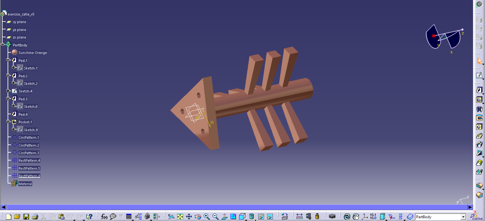

# 🔧 Exercice CATIA V5 — Part Design

<p align="center">
  
</p>

## 📋 Description

Ce projet est un exercice de modélisation 3D réalisé avec **CATIA V5** (Part Design). Il illustre la conception d'une pièce mécanique complexe à partir de fonctions de base et de répétitions de motifs.

La pièce modélisée ressemble à un composant de type **peigne / arbre à cames**, avec un corps central cylindrique et des extensions rectangulaires disposées en motifs.

---

## 🗂️ Structure de l'arbre de conception (Feature Tree)

```
exercice_catia_v5
├── xy plane
├── yz plane
├── zx plane
└── PartBody
    ├── 🟠 Material : Sunshine Orange
    ├── Pad.1       ← Sketch.1  (base principale)
    ├── Pad.2       ← Sketch.2  (corps cylindrique)
    ├── Sketch.4
    ├── Pad.3       ← Sketch.8  (extensions latérales)
    ├── Pad.4
    ├── Pocket.1    ← Sketch.9  (évidement / perçage)
    ├── CircPattern.1  (répétition circulaire 1)
    ├── CircPattern.2  (répétition circulaire 2)
    ├── CircPattern.3  (répétition circulaire 3)
    ├── RectPattern.4  (répétition rectangulaire 4)
    ├── RectPattern.5  (répétition rectangulaire 5)
    ├── RectPattern.6  (répétition rectangulaire 6)
    └── Material
```

---

## ⚙️ Fonctions CATIA utilisées

| Fonction | Description |
|---|---|
| **Pad** | Extrusion de croquis (Sketch) pour créer des volumes solides |
| **Pocket** | Enlèvement de matière par extrusion d'un profil |
| **CircPattern** | Répétition circulaire d'une ou plusieurs fonctions autour d'un axe |
| **RectPattern** | Répétition rectangulaire selon une ou deux directions |
| **Material** | Application d'un matériau visuel (Sunshine Orange) |

---

## 🖼️ Captures d'écran

| Vue multi-fenêtres | Vue isométrique |
|---|---|
|  |  |


---

## 🚀 Comment ouvrir le projet

1. Cloner ce dépôt :
   ```bash
   git clone https://github.com/votre-username/exercice_catia_v5.git
   ```
2. Ouvrir **CATIA V5** sur votre poste.
3. Aller dans `File > Open` et sélectionner le fichier `.CATPart` du projet.
4. L'arbre de conception se chargera automatiquement avec toutes les fonctions.

---

## 📁 Contenu du dépôt

```
exercice_catia_v5/
├── exercice_catia_v5.CATPart   ← Fichier principal de la pièce
├── screenshots/
│   ├── multiview.png
│   └── view_iso.png
└── README.md
```

---

## 🛠️ Logiciel utilisé

- **CATIA V5** — Dassault Systèmes
- Module : **Part Design**
- Format de fichier : `.CATPart`

---

## 👤 Auteur

> Remplacez cette section avec vos informations personnelles.

**Nom :** Votre Nom  
**GitHub :** [@votre-username](https://github.com/votre-username)  
**Établissement / Entreprise :** _(optionnel)_

---

## 📄 Licence

Ce projet est partagé à titre éducatif. Libre de réutilisation avec mention de l'auteur.
