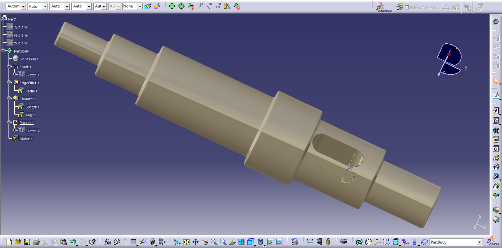
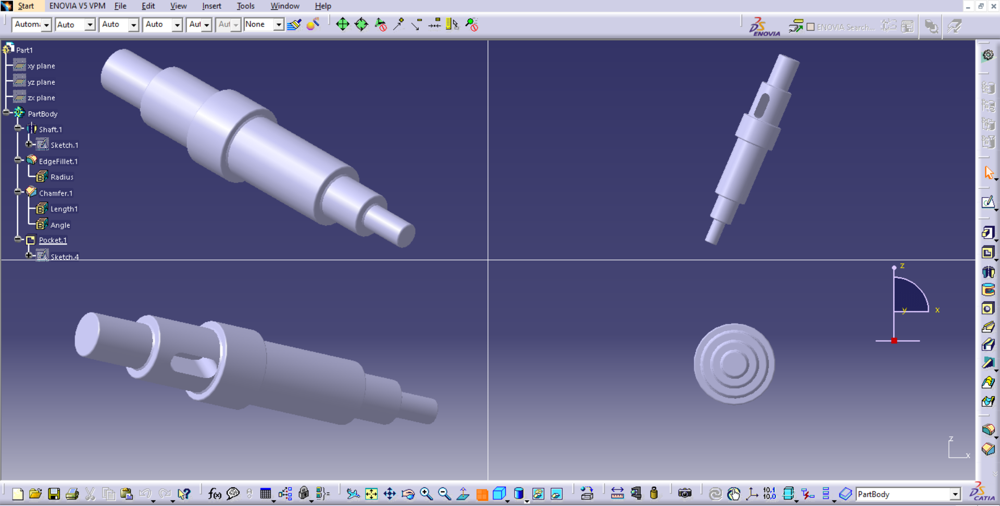

# 🔧 Exercice CATIA V5 — Arbre mécanique avec rainure

  

## 📋 Description

Ce projet est un exercice de modélisation 3D réalisé avec **CATIA V5** (Part Design).  
Il consiste à concevoir un **arbre mécanique étagé** comportant plusieurs diamètres, des chanfreins, des congés ainsi qu’une **rainure longitudinale (lumière)**.

Ce type de pièce est couramment utilisé dans les systèmes mécaniques pour :
- la transmission de mouvement
- le positionnement de composants
- l’assemblage avec clavettes ou goupilles

---

## 🗂️ Structure de l'arbre de conception (Feature Tree)
shaft_catia_v5
├── xy plane
├── yz plane
├── zx plane
└── PartBody
├── 🟠 Shaft.1 ← Sketch.1 (profil tourné principal)
├── EdgeFillet.1 (congés sur les arêtes)
│ └── Radius
├── Chamfer.1 (chanfreins)
│ ├── Length1
│ └── Angle
├── Pocket.1 ← Sketch.4 (rainure longitudinale)
└── Material (Light Beige)
---

## ⚙️ Fonctions CATIA utilisées

| Fonction | Description |
|---|---|
| **Shaft** | Révolution d’un profil pour créer un arbre (pièce de révolution) |
| **Sketch** | Création des profils 2D servant de base aux opérations |
| **Pocket** | Enlèvement de matière pour créer la rainure |
| **Edge Fillet** | Ajout de congés pour adoucir les transitions |
| **Chamfer** | Création de chanfreins pour faciliter l’assemblage |
| **Material** | Application d’un matériau visuel (Light Beige) |

---

## 🖼️ Captures d'écran

| Vue multi-fenêtres | Vue isométrique |
|---|---|
|  |  |

---

## 🎯 Objectifs pédagogiques

- Maîtriser la **fonction Shaft (révolution)** dans CATIA
- Apprendre à créer des **arbres étagés**
- Utiliser les opérations de finition (**Fillet & Chamfer**)
- Réaliser une **rainure avec Pocket**
- Comprendre la logique de construction dans l’arbre des features

---

## 🚀 Comment ouvrir le projet

1. Cloner ce dépôt :
2. Ouvrir CATIA V5
3. Aller dans File > Open
4. Sélectionner le fichier .CATPart
5. Explorer l’arbre de conception dans Part Design

-🛠️ Logiciel utilisé: **CATIA V5 — Dassault Systèmes**
- Module : **Part Design**
- Format de fichier : `.CATPart`

## 👤 Auteur

**Nom :** Mohamed Reda Zhar

**GitHub :** [@MohamedReda2003](https://github.com/MohamedReda2003)  

**Établissement :** ENSA Tétouan

## 📄 Licence

Projet à but éducatif. Libre d’utilisation avec mention de l’auteur.
