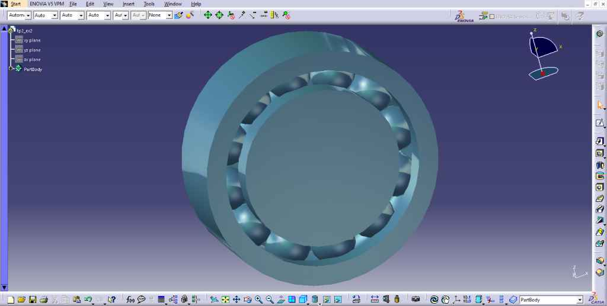
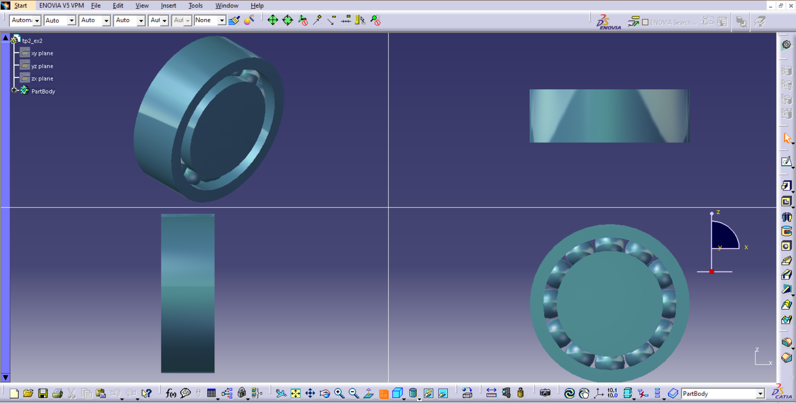

# 🔧 Exercice CATIA V5 — Roulement (Bearing)

<p align="center">
  
</p>

## 📋 Description

Ce projet est un exercice de modélisation 3D réalisé avec **CATIA V5** (Part Design).  
Il représente un **roulement mécanique simplifié**, composé d’une bague extérieure, d’une bague intérieure et d’un ensemble d’éléments roulants répartis de manière circulaire.

Ce type de pièce est utilisé pour :
- réduire les frottements entre pièces en rotation  
- guider des arbres mécaniques  
- supporter des charges radiales et/ou axiales  

---

## 🗂️ Structure de l'arbre de conception (Feature Tree)
```
bearing_catia_v5
├── xy plane
├── yz plane
├── zx plane
└── PartBody
├── 🟢 Pad.1 ← Sketch.1 (bague extérieure)
├── Pocket.1 ← Sketch.2 (alésage intérieur)
├── Groove / Pocket.2 ← Sketch.3 (chemin de roulement)
├── Pad.2 ← Sketch.4 (élément roulant - bille)
├── CircPattern.1 (répétition circulaire des billes)
├── EdgeFillet.1 (finitions / congés)
└── Material (Blue Metal)
```

---

## ⚙️ Fonctions CATIA utilisées

| Fonction | Description |
|---|---|
| **Pad** | Création des volumes (bague, bille) par extrusion |
| **Pocket** | Enlèvement de matière pour créer les alésages et chemins |
| **Sketch** | Définition des profils 2D |
| **Circular Pattern** | Répétition circulaire des éléments roulants |
| **Edge Fillet** | Ajout de congés pour lisser les transitions |
| **Material** | Application d’un matériau visuel (Blue Metal) |

---

## 🖼️ Captures d'écran

| Vue multi-fenêtres | Vue isométrique |
|---|---|
|  |  |

---

## 🎯 Objectifs pédagogiques

- Comprendre la modélisation d’un **assemblage simplifié dans une seule pièce**
- Utiliser efficacement la **répétition circulaire (Circular Pattern)**
- Créer des **formes cylindriques et des cavités internes**
- Modéliser des **éléments répétitifs (billes)**
- Structurer un arbre de conception propre et logique

---

## 🚀 Comment ouvrir le projet

1. Cloner ce dépôt :
2. Ouvrir `CATIA V5`
3. Aller dans `File > Open`
4. Sélectionner le fichier `.CATPart`
5. Explorer le modèle dans `Part Design`

- **🛠️ Logiciel utilisé**:CATIA V5 — Dassault Systèmes
- **Module :** Part Design
- **Format :** `.CATPart`
  
👤 Auteur

- **Nom :** Mohamed Reda Zhar
- **GitHub :** [@MohamedReda2003](https://github.com/MohamedReda2003)  
- **Établissement :** ENSA Tétouan

## 📄 Licence

Projet à but éducatif. Libre d’utilisation avec mention de l’auteur.
